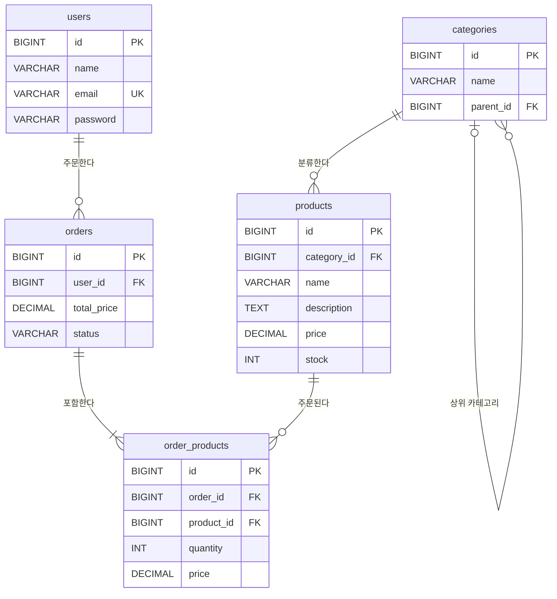

# 🚀 스파르타 MSA 과정 교안 예시 코드

> 스파르타 MSA 과정 **Part 01** 강의에서 사용하는 Spring Boot 기반 예시 프로젝트입니다.
> 주차·일차별 브랜치로 나뉘어 있어, 강의 진도에 맞춰 코드를 따라가며 학습할 수 있습니다.


---

## 📚 목차

- [Week 01 · Day 03 학습 내용](#-week-01--day-03-학습-내용)
- [브랜치 구성](#-브랜치-구성)
- [기술 스택](#-기술-스택)
- [프로젝트 구조](#-프로젝트-구조)
- [시작하기](#-시작하기)

---

## 📌 Week 01 · Day 03 학습 내용

> **도메인 모델링과 연관관계 매핑** — 커머스 도메인(상품·카테고리·주문)을 설계하고 `@ManyToOne` 연관관계를 매핑합니다.

| 주제 | 내용 | 관련 파일 |
|---|---|---|
| **다대일 연관관계** | `Product → Category`, `Order → User`를 `@ManyToOne(fetch = LAZY)` + `@JoinColumn`으로 매핑 | `Product.java`, `Order.java` |
| **자기 참조 연관관계** | `Category.parent`로 상위·하위 카테고리 계층 구조 표현, `@JsonBackReference`로 순환 참조 방지 | `domain/category/entity/Category.java` |
| **다대다 → 중간 엔티티** | `Order` ↔ `Product` 다대다 관계를 `OrderProduct`로 풀고, 주문 시점의 가격(`price`)을 따로 저장 | `domain/order/entity/OrderProduct.java` |
| **Enum 매핑** | `@Enumerated(EnumType.STRING)`으로 주문 상태(`PENDING`, `COMPLETED`, `CANCELED`)를 문자열로 저장 | `global/constants/enums/OrderStatus.java` |
| **Repository 추가** | 도메인별 `JpaRepository` 인터페이스 생성 | `CategoryRepository`, `ProductRepository`, `OrderRepository`, `OrderProductRepository` |
| **DB 마이그레이션** | Flyway `V3`로 `products`, `orders`, `order_products`, `categories` 테이블 생성 | `db/migration/V3__create_product_table.sql` |
| **엔티티 정리** | `User`의 설명 주석 정리, `updatedAt`을 `nullable = false`로 변경 | `domain/user/entity/User.java` |

### 🗺 ERD



### ✅ 체크포인트

- [ ] 애플리케이션 실행 시 Flyway가 `V3__create_product_table.sql`을 적용하고 4개 테이블이 생성된다
- [ ] 연관관계에서 `FetchType.LAZY`를 기본으로 쓰는 이유를 설명할 수 있다
- [ ] `OrderProduct`에 상품 가격을 따로 저장하는 이유(주문 이후 상품 가격 변경)를 설명할 수 있다

---

## 🌿 브랜치 구성

각 주차는 `original`(시작 코드)과 `day-XX`(일차별 완성 코드) 브랜치로 구성되며, `extra`는 추가 학습 브랜치입니다.

| 주차 | 시작 코드 | Day 01 | Day 02 | Day 03 | Day 04 / 추가 학습 |
|:---:|:---:|:---:|:---:|:---:|:---:|
| **Week 01** | `week-01/original` | `week-01/day-01` | `week-01/day-02` | **`week-01/day-03`** 👈 | `week-01/day-04` |
| **Week 02** | `week-02/original` | `week-02/day-01` | `week-02/day-02` | `week-02/day-03` | `week-02/extra` (추가 학습) |

```bash
# 이전 단계와 비교
git diff week-01/day-02 week-01/day-03

# 다음 강의 단계로 이동
git checkout week-01/day-04
```

---

## 🛠 기술 스택

| 분류 | 사용 기술 |
|---|---|
| **Language / Build** | Java 21, Gradle 8.14 |
| **Framework** | Spring Boot 3.3, Spring Cloud 2023.0 |
| **Web Server** | Undertow (Tomcat 대체) |
| **Persistence** | Spring Data JPA, QueryDSL 5.0, Flyway |
| **Database** | PostgreSQL |
| **Communication** | Spring Cloud OpenFeign, Spring Retry |
| **Validation** | Spring Validation (Hibernate Validator) |
| **Mapping** | MapStruct 1.5, Lombok |
| **API Docs** | springdoc-openapi (Swagger UI) |
| **Monitoring** | Spring Boot Actuator |
| **Test** | JUnit 5, Spring Boot Test |

---

## 📁 프로젝트 구조

```
sparta-msa-lesson-part-01
├── build.gradle
├── settings.gradle
├── gradle/wrapper
└── src
    ├── main
    │   ├── java/com/sparta/msa/lesson
    │   │   ├── domain
    │   │   │   ├── category
    │   │   │   │   ├── entity
    │   │   │   │   │   └── Category.java                ✨ NEW
    │   │   │   │   └── repository
    │   │   │   │       └── CategoryRepository.java      ✨ NEW
    │   │   │   ├── order
    │   │   │   │   ├── entity
    │   │   │   │   │   ├── Order.java                   ✨ NEW
    │   │   │   │   │   └── OrderProduct.java            ✨ NEW
    │   │   │   │   └── repository
    │   │   │   │       ├── OrderProductRepository.java  ✨ NEW
    │   │   │   │       └── OrderRepository.java         ✨ NEW
    │   │   │   ├── product
    │   │   │   │   ├── entity
    │   │   │   │   │   └── Product.java                 ✨ NEW
    │   │   │   │   └── repository
    │   │   │   │       └── ProductRepository.java       ✨ NEW
    │   │   │   └── user
    │   │   │       ├── entity
    │   │   │       │   └── User.java                    📝 UPDATED
    │   │   │       └── repository
    │   │   │           └── UserRepository.java
    │   │   ├── global
    │   │   │   ├── config
    │   │   │   │   └── SwaggerConfig.java
    │   │   │   └── constants
    │   │   │       ├── enums
    │   │   │       │   └── OrderStatus.java             ✨ NEW
    │   │   │       └── Constants.java
    │   │   └── LessonApplication.java
    │   └── resources
    │       ├── db/migration
    │       │   ├── V1__init_table.sql
    │       │   ├── V2__create_users_table.sql
    │       │   └── V3__create_product_table.sql         ✨ NEW
    │       └── application.yml
    └── test/java/com/sparta/msa/lesson
        └── LessonApplicationTests.java
```

---

## ▶️ 시작하기

### 1. 사전 준비

- **JDK 21**
- **PostgreSQL** — `localhost:5432`에 `sparta` 데이터베이스 생성

| 항목 | 값 |
|---|---|
| URL | `jdbc:postgresql://localhost:5432/sparta` |
| Username | `postgres` |
| Password | `postgres` |

```bash
# Docker로 PostgreSQL 실행 (선택)
docker run -d --name sparta-postgres \
  -e POSTGRES_USER=postgres \
  -e POSTGRES_PASSWORD=postgres \
  -e POSTGRES_DB=sparta \
  -p 5432:5432 postgres
```

### 2. 클론 및 빌드

```bash
git clone <repository-url>
cd sparta-msa-lesson-part-01
git checkout week-01/day-03

./gradlew build
```

### 3. 실행

```bash
./gradlew bootRun
```

| 주소 | 설명 |
|---|---|
| http://localhost:8080 | 애플리케이션 |
| http://localhost:8080/swagger-ui/index.html | Swagger UI |

### 4. 테스트

```bash
./gradlew test
```

---

<div align="center">

**Happy Coding! 🎉**

</div>
